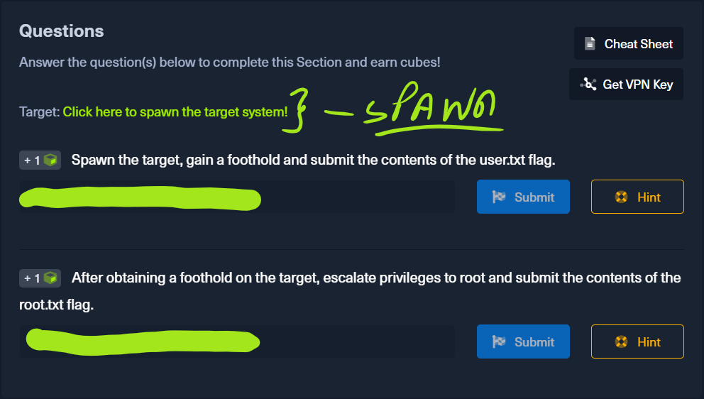

# Steps

## Initial Setup on **HackTheBox**.

We first start off by spawning our target on the hackthebox platform.



Now that we have gotten our target spawned we can copy the IP\_Address: `10.129.164.26`.

With this the initial getting ready steps are prepared. Next is none other than loading into **Kali Linux** / **Pwn Box**, for this walkthrough we shall use **Kali Linux** going forward.

## Initial Enumeration with **Nmap**.

Now we are finally ready to start our long awaited **Enumeration Process**. We start off by open the terminal instance and running a quick nmap scan against the target Ip\_Address using :

```bash
nmap -sV --open -oA knowledge_check_initial_scan 10.129.164.26
```

Useful Tips

* **-sV**: is used to output verbose logging.
* **–open**: is used to refer to open ports.
* **-oA**: is used to output logs into 3 different output formats. It is followed by the name output file name.
* Finally the IP is added after the proceeding parameters. This data can be checked at [nmap\_initial\_results.md](nmap\_initial\_results.md "mention")

We saw from the material that port **22** is running **SSH** and port **80** is running **HTTP**. noticing this, we decide to proceed by running a next nmap script to enumerate the http connection.

```bash
nmap -sV -A --script=http-enum 10.129.164.26 -p 80
```

This then outputs our [http-enum](my-findings-after-running-the-http-enum-script..md) findings.

We see from this that there are a few directories we can browse to:

> \| **http-enum:**
>
> \| /admin/: Possible admin folder
>
> \| /admin/index.php: Possible admin folder
>
> \| /backups/: Backup folder w/ directory listing
>
> \| /robots.txt: Robots file
>
> |\_ /data/: Potentially interesting directory w/ listing on 'apache/2.4.41 (ubuntu)'

We take this chance to then browse to these directories and find that **/admin/** redirects to **/admin/index.php** and is the location of the admin login page.

!\[\[admin.png]]

We first attempt doing **Ctrl / Cmd + U** to view the source code of the page to search for any possible credentials left with in but found nothing of use.&#x20;

So now we check out our other options, and we found that only **/data/** had something useful. We found a users directory at **/data/users/** and through opening it we found the **admin.xml**, in which we discovered the user name and what looks to be a password.

Sadly the password proved to be incorrect and through some research online we discovered that some persons encrypt the passwords for an extra layer of security. So we decided to de-hash the password using an online tool called [DeHash.me](https://dehash.me). Through this we discovered that the password is **admin**.&#x20;

We then proceed to navigate back to the **/admin/** page and proceed to try the credentials. We then discover that the credentials were indeed correct and we got into the admin panel.

!\[\[getting-started.png]] Now, the following task is to try to get into the system. We proceeded promptly to **Files** and saw that we could indeed upload a file and unfortunately we also discovered that this functionality was disabled due to the flash player technology becoming deprecated. We are now stumped and have no where else to go, so we proceed to change our approach.

## Initial Foothold with **MsfConsole**.

We now open our terminal and proceed to launch the msfconsole:

```bash
msfconsole
```

This launches the console and then proceeds to prompt us for entry. We start by searching for an exploit for GetSimple CMS as it seems to be some plugin of sorts.

```
search getsimple cms
```

This then reveals to us that we can use to possible exploits. We read the info for both using `info 1` or `info 0`.

We then check the options to be edited with `show options`. Through this we notice that **RHOSTS** and **LHOST** need to be set. **RHOSTS** is set to the ip address of the remote host, and **LHOST** is set to our local ip address - - - should be **tun0**.

Our next step is to check if its vulnerable to the exploit by using `check`. We discover that it is possible and proceed to activate the exploit, for that we do `run` | `exploit`. Both commands will work just fine to run the selected exploit.

> We then get access to the _meterpreter_ shell and we proceed to execute `pwd` to see what directory we are currently in. This reveals to us that we are located in “/var/www/html/theme”.

We then know that we are looking for user.txt, and we know that it is located in the home directory of the user so we use `cd /home` to get to the **home** directory folder and we run `ls -al` to list all folders and we see that there is a folder called **“mrb3n”**. Opening the directory with `cd` we discover the user.txt file we are in search for.. among other things. We proceed to open the file by using:

```
cat user.txt
```

> This reveals to us the content of user.txt which is _<mark style="color:green;">`7002d65b149b0a4d19132a66feed21d8`</mark>_.

## Elevating Privileges

We now have finally reached close to the end and are now in the process of solving the final question, which asks of us to read the contents of **root.txt**.

We right off the bat go to the root of the system tree by using `cd /`. Then we proceed to list all of its contents and their rights with `ls -al`. This outputs a lot of information for us, and even reveals the location we are looking to enter **/root** directory. Sadly upon running `cd /root` we discover that we don’t have access to this particular directory as the user we are. Now the only option is to get elevated privileges so to the first thing we do is search for some possible vulnerabilities in how the account is set up by running:

```bash
sudo -l
```

Right at that point we are disappointed though as we are greeted with an error saying that the command isn't found. Lucky that weas just because we weren’t in an upgraded shell.

We see that meterpreter has an upgraded shell we call right there by executing `shell`. This the outputs some words and leaves the cursor in a blank spot. To test if we can run commands we do `id` and see that we can. We now try again to execute `sudo -l` we now see that there is a vulnerability we can exploit. We see that can access the php shell as anyone without the need for a password. With this knowledge we then proceed to run a python script we found on **GTFObins**:

```shell
CMD="/bin/sh"
php -r 'system("$CMD");'
```

We then notice no change so we run `whoami` and see that we are user **root**. Yes!!, we exclaim as we can now proceed to check out the **/root** directory. We proceed to go to the directory using `cd /root`, and we then do `ls -al` which reveals to us that we have found **root.txt**. We wasted no time to run `cat root.txt` and get the contents: _<mark style="color:green;">`f1fba6e9f71efb2630e6e34da6387842`</mark>_.

Now we have completed **Knowledge Check!!**.
